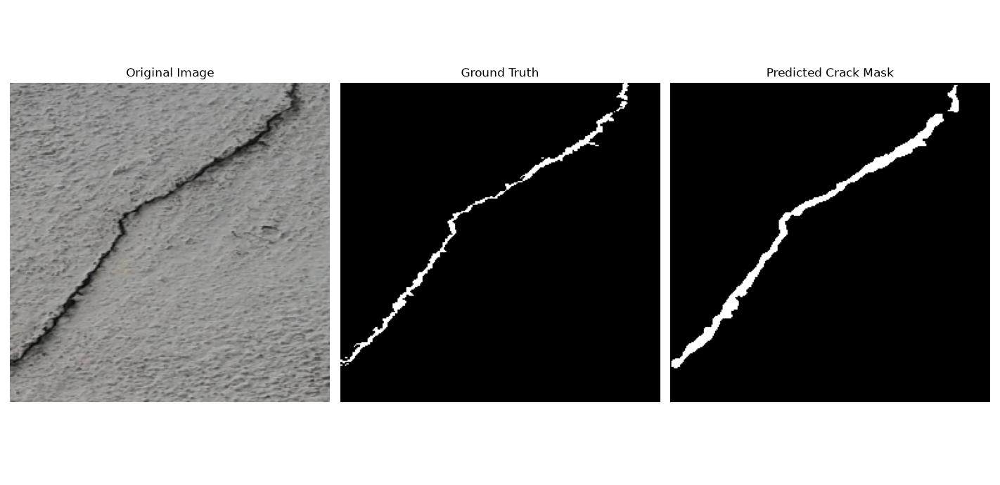

# 🧱 Concrete Crack Segmentation Using U-Net

**Name:** Sparsh Kumar Suman  
**Registration No.:** 24BAI10205  

---

## 📊 Final Results

### Dataset & Training Information

| Parameter | Value |
|---|---:|
| **Training Pairs** | **300** |
| **Testing Pairs** | **237** |
| **Total Image-Mask Pairs** | **537** |
| **Training Epochs** | **5** |
| **Training Device** | **CPU** |

---

## 📈 Training Performance

The U-Net model was trained for 5 epochs. The training loss decreased
consistently during training.

### Epoch vs Training Loss

| Epoch | Training Loss |
|---:|---:|
| **1** | **0.4579** |
| **2** | **0.3165** |
| **3** | **0.2751** |
| **4** | **0.2509** |
| **5** | **0.2320** |

### Loss Improvement

| Parameter | Value |
|---|---:|
| Initial Loss | **0.4579** |
| Final Loss | **0.2320** |
| Absolute Loss Reduction | **0.2259** |
| Percentage Loss Reduction | **≈ 49.33%** |

The training loss decreased from **0.4579 in Epoch 1** to **0.2320
in Epoch 5**, representing an approximately **49.33% reduction**.

---

## 🧪 Final Test Performance

The trained model was evaluated on **237 testing image-mask pairs**.

| Metric | Score | Percentage |
|---|---:|---:|
| **IoU** | **0.6195** | **61.95%** |
| **Dice Score** | **0.7494** | **74.94%** |
| **Precision** | **0.8283** | **82.83%** |
| **Recall** | **0.7281** | **72.81%** |
| **F1 Score** | **0.7494** | **74.94%** |

---

# 🖼️ Generated Segmentation Result

The following image shows the final generated output of the
concrete crack segmentation system.



---

# 📌 Project Overview

A deep learning-based **semantic segmentation system for automatic
detection and pixel-level localization of cracks in concrete surfaces**
using a **U-Net architecture implemented in PyTorch**.

The model takes a concrete surface image as input and produces a
**binary segmentation mask** highlighting the regions containing cracks.

Unlike image classification, which only determines whether a crack is
present, semantic segmentation performs **pixel-level prediction**,
allowing the exact regions affected by cracks to be identified.

---

## 🎯 Objectives

- Automatically detect cracks in concrete surfaces.
- Perform pixel-level crack segmentation.
- Implement and train a U-Net semantic segmentation model.
- Compare predicted masks with ground-truth masks.
- Evaluate the model using standard segmentation metrics.
- Provide a foundation for automated infrastructure inspection.

---

# 🔄 Project Pipeline

```text
Input Concrete Image
        ↓
Image Preprocessing
        ↓
      U-Net
        ↓
Pixel-Level Prediction
        ↓
Binary Crack Mask
        ↓
Crack / Damage Analysis

# 📂 Project Structure

```text
DeepCrack/
│
├── dataset/
│
├── preprocessing/
│
├── src/
│   ├── config.py
│   ├── dataset.py
│   ├── model.py
│   ├── train.py
│   ├── evaluate.py
│   ├── visualize.py
│   └── main.py
│
├── outputs/
│   ├── checkpoints/
│   │   ├── epoch_1.pth
│   │   ├── epoch_2.pth
│   │   ├── epoch_3.pth
│   │   ├── epoch_4.pth
│   │   ├── epoch_5.pth
│   │   ├── best_model.pth
│   │   ├── latest_model.pth
│   │   └── final_model.pth
│   │
│   └── ...
│
├── Figure_1.png
├── README.md
└── requirements.txt